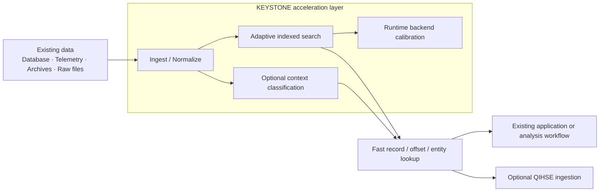
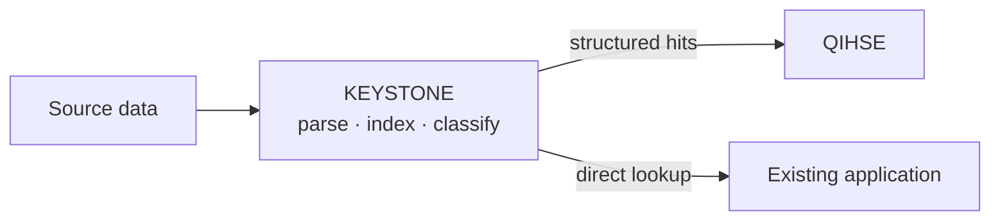

<p align="center">
  
</p>

# KEYSTONE

### Faster access to high-value records without replacing the systems that already store them.

[](https://en.wikipedia.org/wiki/C11_(C_standard_revision))
[](https://en.wikipedia.org/wiki/Advanced_Vector_Extensions)
[](https://www.openmp.org/)
[](https://www.kernel.org/)
[](LICENSE)

**KEYSTONE is a high-performance indexing, ingestion, and lookup engine for large datasets.** It can run as a standalone acceleration layer or feed structured data directly into [QIHSE](https://github.com/SWORDIntel/QIHSE).

It is designed to make existing infrastructure work harder: reduce lookup cost, process large batches efficiently, turn messy source data into searchable records, and choose the fastest viable execution path on the hardware already available.

**You do not have to adopt the whole stack.** KEYSTONE's search, ingestion, archive, classification, and QIHSE integration capabilities can be used independently where they make sense.

[Business benefits](#why-keystone) · [How it works](#how-it-fits) · [Measured results](#measured-results) · [Quick start](#quick-start) · [Technical docs](docs/README.md)

---

## Why KEYSTONE

Large data systems often accumulate cost in places that are difficult to see on a storage invoice: repeated lookup work, duplicated indexing logic, slow batch processing, underused CPU capabilities, and expensive preprocessing before useful records can even be queried.

KEYSTONE targets that layer.

| Business problem | KEYSTONE response |
|---|---|
| **Large datasets become slower and more expensive to search** | Adaptive indexed lookup reduces the amount of work required to locate records. |
| **Existing servers are not used efficiently** | Runtime calibration measures viable local execution paths and selects an appropriate backend for the workload. |
| **Different services duplicate search and preprocessing logic** | A reusable native indexing layer centralizes high-volume lookup and ingestion primitives. |
| **Raw or compressed data takes too much preprocessing** | Archive-aware and unstructured-data ingestion can turn source material into searchable identifiers close to the data. |
| **Performance claims are difficult to trust** | Backend decisions and benchmark methodology are exposed so results can be reproduced on the target hardware. |
| **Replacing the primary database is too disruptive** | KEYSTONE can sit beside an existing system or act as a preprocessing layer rather than requiring a database migration. |

### What that means operationally

- **Faster retrieval where lookup is a bottleneck.**
- **Better use of hardware already owned** before adding more infrastructure.
- **Lower integration risk** because KEYSTONE can be adopted as one component rather than an all-or-nothing platform.
- **More predictable indexing behavior** across repeated processing runs.
- **A measurable optimization path:** local calibration, decision provenance, tests, and benchmark tooling are part of the implementation.
- **A direct path into QIHSE** when a broader multi-model database runtime is useful, without making QIHSE a prerequisite.

---

## What KEYSTONE Does

KEYSTONE combines several focused capabilities behind one native library:

| Capability | Practical purpose |
|---|---|
| **Adaptive indexed search** | Finds records in large sorted keyspaces using anchor-guided interpolation rather than relying only on generic binary search. |
| **High-volume batch lookup** | Processes large query sets through optimized C, OpenMP, and optional numerical backends. |
| **Runtime backend calibration** | Measures viable execution paths on the local machine and caches the fastest choice for comparable workloads. |
| **Unstructured-data ingestion** | Extracts useful identifiers from noisy source data without requiring a heavyweight parsing stack. |
| **Archive-aware processing** | Supports `.tar.zst` workflows so compressed datasets can participate in the indexing pipeline. |
| **Context classification** | An optional small native neural model can classify extracted context for downstream triage. |
| **Vector similarity search** | LSH-indexed cosine/L2/dot similarity over 384-dim float32 vectors with SIMD acceleration and CUDA/VPU paths. |
| **QIHSE integration** | Can act as a native preprocessing/ingestion layer for the QIHSE database ecosystem. |

The core search engine is useful by itself. The ingestion, archive, classification, Fortran, OpenMP, SIMD, and QIHSE paths are additive capabilities rather than mandatory dependencies.

---

## How It Fits



The design is intentionally database-adjacent. KEYSTONE does not need to own the system of record; it accelerates the path between source data and the record an application actually needs.

For the detailed search pipeline, backend-selection model, feature matrix, memory behavior, SIMD paths, and integration internals, see the [technical overview](docs/TECHNICAL_OVERVIEW.md).

---

## Measured Results

KEYSTONE includes benchmark tooling because performance should be demonstrated on the hardware and workload that will actually run it.

One current integrated benchmark on an **Intel Xeon E5-2407** measured the KEYSTONE sorted-column search at:

| Same-host lookup benchmark | Throughput | p50 latency |
|---|---:|---:|
| Standard binary search, 1M rows | 2,016,334 lookups/s | 415 ns |
| **KEYSTONE anchor search, 1M rows** | **3,510,610 lookups/s** | **218 ns** |

That run represents roughly **1.74× higher throughput and 47% lower median lookup latency** against the benchmark's standard binary-search baseline on that host.

These are **measured results, not universal guarantees**. CPU, compiler flags, dataset distribution, hit rate, cache state, batch shape, and enabled backends materially affect performance. Full methodology and additional measurements are kept in [`docs/BENCHMARK_RESULTS.md`](docs/BENCHMARK_RESULTS.md).

### Vector Engine Benchmarks

The KEYSTONE Vector Engine adds hardware-agnostic vector similarity search with LSH coarse indexing and SIMD exact rerank. Benchmarks were run on an **Intel Xeon E5-2407** (SSE4.2 + AVX, no AVX2/AVX-512) with 384-dimensional float32 vectors (SentenceTransformer all-MiniLM-L6-v2 output dimension):

| Corpus size | Backend | Upsert rate | Search latency | Throughput | vs NumPy |
|---|---|---:|---:|---:|---:|
| 1,000 vectors | Scalar | 16,949 vec/s | 0.27 ms/query | 3,757 q/s | 2.5× |
| 1,000 vectors | **AVX** | **17,241 vec/s** | **0.25 ms/query** | **3,965 q/s** | **2.5×** |
| 1,000 vectors | VPU (Myriad X) | 16,949 vec/s | 1.04 ms/query | 962 q/s | 0.6× |
| 10,000 vectors | Scalar | 10,267 vec/s | 1.85 ms/query | 542 q/s | 4.4× |
| 10,000 vectors | **AVX** | **10,493 vec/s** | **1.80 ms/query** | **556 q/s** | **4.4×** |
| 100,000 vectors | Scalar | 2,831 vec/s | 2.52 ms/query | 397 q/s | 30.8× |
| 100,000 vectors | **AVX** | **2,752 vec/s** | **2.36 ms/query** | **423 q/s** | **30.8×** |
| 100,000 vectors | NumPy brute force | — | 72.89 ms/query | 14 q/s | 1.0× (baseline) |

**Key findings:**

- **30.8× faster than NumPy** brute-force search at 100K vectors (AVX backend with LSH coarse index)
- **AVX backend** uses 256-bit YMM float operations (8× float32 per instruction) — no AVX2 or AVX-512 required
- **VPU (Myriad X)** is available for batch similarity computation via Unix socket, with graceful fallback to CPU SIMD if the VPU is unavailable
- **LSH coarse index** reduces search from O(n) brute force to sub-linear candidate retrieval + exact SIMD rerank
- **Graceful fallback chain:** CUDA → AVX-512 → AVX2 → AVX → SSE4.2 → NEON → VPU → scalar (always compiled)

The vector engine is **hardware-agnostic**: the scalar path builds and runs on any Linux box with a C compiler. SIMD backends are compile-time guarded and runtime dispatched — a binary built on an AVX-512 server runs correctly on an SSE2-only machine via runtime detection.

---

## Current State

KEYSTONE is a working native library and test/benchmark suite.

**Implemented today:**

- scalar and anchor-guided `int64_t` search;
- batch lookup and measured runtime backend selection;
- decision provenance for backend choices;
- SSE4.2, AVX, and AVX2 local scan paths where supported;
- build-gated AVX-512 path;
- OpenMP batch execution;
- optional Fortran batch backend;
- `.tar.zst` archive workflows;
- unstructured-data tokenizer and hash indexer;
- native context micro-model;
- QIHSE bridge support;
- **vector similarity engine** with LSH coarse indexing, SIMD cosine/L2/dot distance, CUDA and VPU (Myriad X) accelerated paths, and 8-level graceful fallback (scalar always compiled);
- correctness and performance test infrastructure.

GPU/NPU execution is not presented as a current production backend. The project detects or contains experimental accelerator work in places, but accelerator support is only considered implemented when correctness, transfer cost, fallback behavior, dispatch provenance, and target-hardware measurements are established.

See [`docs/STATUS_SUMMARY.md`](docs/STATUS_SUMMARY.md) for the engineering status and current backlog.

---

## Deployment Model

KEYSTONE is designed to be built for the machine, container image, or target silicon family where it will run. The normal build uses native optimization and can enable resident CPU capabilities and optional components when available.

This gives deployments three useful properties:

1. **No requirement for specialized accelerator hardware.** The current core runs on CPU.
2. **Optional acceleration stays optional.** OpenMP, Fortran, SIMD paths, archive support, classification, and QIHSE integration can be selected independently.
3. **Backend choice is observable.** The runtime exposes whether a decision came from a fast path, measurement, cache, or fallback rather than hiding the execution path.

Detailed build modes and feature switches are documented in [`docs/BUILD_MODES.md`](docs/BUILD_MODES.md).

---

## Quick Start

```bash
git clone https://github.com/SWORDIntel/KEYSTONE.git
cd KEYSTONE
make clean
make test
```

Build benchmarks:

```bash
make benchmarks
./benchmarks/dsmil_benchmark
./benchmarks/performance_proof
```

A scalar comparison build is available for baseline testing:

```bash
make clean
KEYSTONE_ENABLE_FORTRAN=0 KEYSTONE_ENABLE_TAR_ZST=0 KEYSTONE_FORCE_SCALAR=1 make test
```

For integration guidance, see [`docs/INTEGRATION.md`](docs/INTEGRATION.md).

---

## QIHSE Integration

KEYSTONE can operate as the ingestion and lookup front end for [QIHSE](https://github.com/SWORDIntel/QIHSE), while remaining independently usable.



To build the bridge when QIHSE is available locally:

```bash
make clean
KEYSTONE_ENABLE_QIHSE_BRIDGE=1 QIHSE_ROOT=/path/to/QIHSE make
```

---

## Technical Snapshot

For readers who want the implementation detail without making it the front door:

- **Primary implementation:** C11
- **Current execution surface:** scalar C, SSE4.2, AVX (256-bit YMM), AVX2, build-gated AVX-512, optimized C batch, OpenMP, optional Fortran, optional CUDA (soft-loaded), optional VPU (Myriad X, guarded)
- **Search model:** anchor-guided interpolation over sorted `int64_t` keyspaces; vector similarity via LSH coarse index + SIMD exact rerank
- **Auto-selection:** first-use local timing calibration with cached decisions; runtime CPUID dispatch for SIMD; dlopen for CUDA; socket probe for VPU
- **Data ingestion:** raw/unstructured tokenization, FNV-1a projection, optional archive handling
- **Classification:** native 260 → 64 → 6 context micro-model
- **Vector engine:** 384-dim float32 similarity search with LSH, cosine/L2/dot metrics, 8-level graceful fallback (scalar → VPU → NEON → SSE4.2 → AVX → AVX2 → AVX-512 → CUDA)
- **Platform:** Linux (x86-64, ARM64)
- **Testing posture:** correctness cross-checks plus workload- and backend-aware benchmarks

### Documentation

| Document | Purpose |
|---|---|
| [`docs/README.md`](docs/README.md) | Documentation map |
| [`docs/TECHNICAL_OVERVIEW.md`](docs/TECHNICAL_OVERVIEW.md) | Architecture, backend selection, feature matrix, memory and execution model |
| [`docs/STATUS_SUMMARY.md`](docs/STATUS_SUMMARY.md) | What is implemented and what remains |
| [`docs/BENCHMARK_RESULTS.md`](docs/BENCHMARK_RESULTS.md) | Benchmark methodology and measured results |
| [`vector_engine/keystone_vector_engine.h`](vector_engine/keystone_vector_engine.h) | Vector engine API — similarity search with LSH + SIMD + CUDA + VPU |
| [`vector_engine/build_vector_engine.sh`](vector_engine/build_vector_engine.sh) | Auto-detecting build script for vector engine |
| [`docs/BUILD_MODES.md`](docs/BUILD_MODES.md) | Native/scalar/optional build configuration |
| [`docs/INTEGRATION.md`](docs/INTEGRATION.md) | Integration guidance |
| [`docs/ACCELERATOR_CONTRACT.md`](docs/ACCELERATOR_CONTRACT.md) | Requirements for adding accelerator backends |
| [`docs/TELEMETRY_PROCESSOR.md`](docs/TELEMETRY_PROCESSOR.md) | Telemetry processor details |

---

## What KEYSTONE Is Not

KEYSTONE is not a replacement for every database, an ORM, a dashboard platform, or a general-purpose ETL suite.

It is a focused acceleration layer for indexing, lookup, and preprocessing workloads where retrieval cost, predictable record identity, and measurable execution behavior matter.

---

## License

**AGPL-3.0-or-later.** See [LICENSE](LICENSE) before use, modification, redistribution, hosting, or derivative work.

Commercial, proprietary, or hosted use that is incompatible with AGPL obligations requires separate permission or licensing from the repository owner.

---

<div align="center">

**KEYSTONE**  
Fast retrieval. Measurable execution. Use only what you need.

</div>
