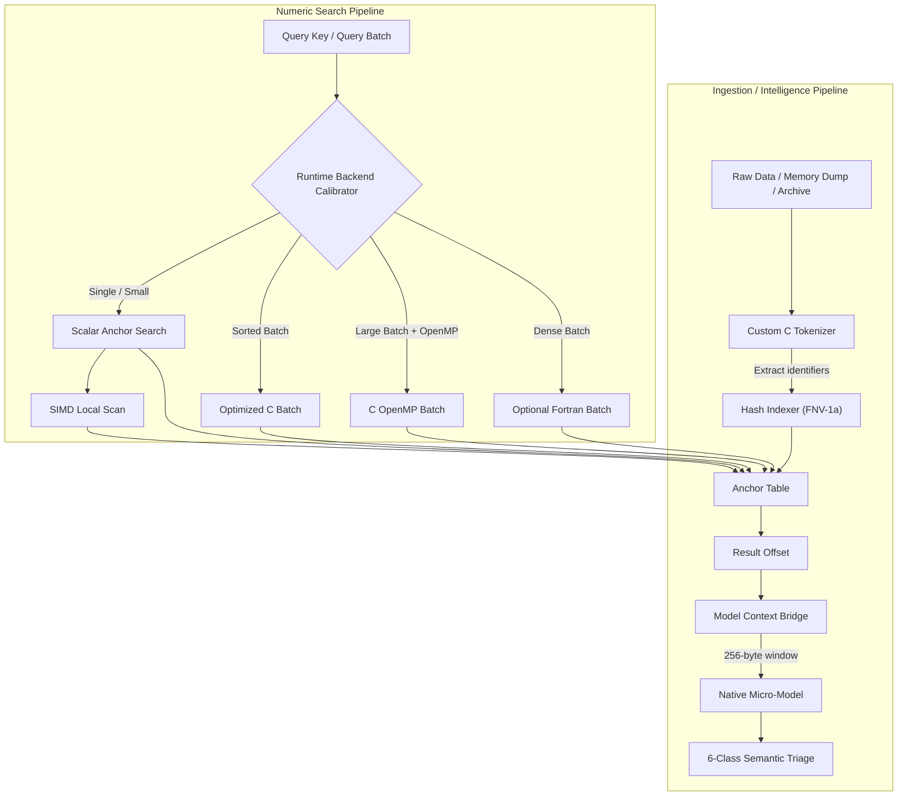
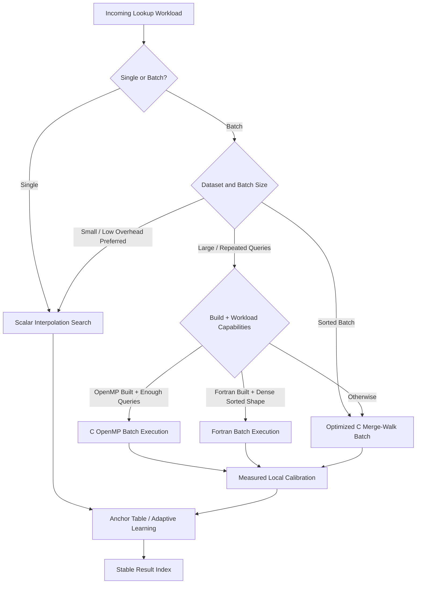
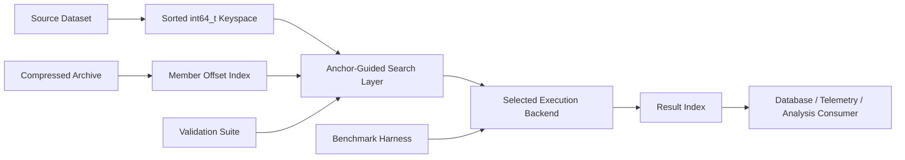

# KEYSTONE Technical Overview

This document contains the implementation detail intentionally kept out of the root README. The README explains what KEYSTONE is and why it matters; this document explains how the current implementation is structured.

## Architecture



## Backend Selection Model



The selector is intended to make execution choices measurable rather than purely heuristic. Normal uncached batch decisions can benchmark viable candidates, cache the result against workload/host characteristics, and expose the decision source through the public API.

## Data Flow



## Core Search Model

KEYSTONE's current primary search surface operates on sorted `int64_t` keyspaces. Anchor points provide learned/local guidance into the sorted domain and scalar interpolation resolves candidate regions. Small local windows can use architecture-specific scan implementations when the build and runtime CPU support them.

The implementation retains a scalar reference path so optimized backends can be checked against the same lookup semantics.

### Current CPU execution paths

- scalar C reference/anchor search;
- optimized C batch path;
- SSE4.2 local scan on supported x86 builds;
- AVX2 local scan on supported x86 builds;
- build-gated AVX-512 local scan;
- OpenMP batch execution;
- optional Fortran batch backend.

AMX feature detection exists, but there is no current AMX search backend claim. GPU and NPU execution should likewise be treated as future/experimental backend families until their correctness, transfer costs, fallback behavior, dispatch provenance, and target-device measurements satisfy the accelerator contract.

## Runtime Calibration

`keystone_search_batch_auto()` can calibrate viable batch backends on a cache miss rather than assuming a fixed backend is best for every machine or query shape.

Current decision state includes:

- selected backend;
- decision source such as fast path, measured, cache, or static fallback;
- query-shape classification;
- measured latency information including p95 where available;
- calibration-run and candidate information used by benchmark tooling.

The calibration cache currently keys on CPU feature mask, array-size bucket, query-count bucket, and thread count. Additional workload-shape fields remain part of the engineering backlog.

## System Profile

| Layer | Function |
|---|---|
| **Core search engine** | Anchor-guided interpolation over sorted integer data. |
| **Dirty-data tokenizer** | Extracts identifiers from noisy/unstructured source material without allocation-heavy parsing. |
| **Hash indexer** | Projects heterogeneous strings into a 64-bit integer search space using FNV-1a. |
| **Context bridge** | Extracts bounded context windows around matched offsets. |
| **Micro-model inference** | Native 260 → 64 → 6 feed-forward classification for optional semantic triage. |
| **Adaptive backend layer** | Routes batch workloads across viable scalar, optimized C, OpenMP, and optional Fortran paths. |
| **Anchor table** | Maintains search guidance for repeated lookup behavior. |
| **Archive interface** | Supports `.tar.zst` member workflows when archive dependencies are enabled. |
| **QIHSE bridge** | Streams structured results into QIHSE when compiled with integration support. |

## Feature Matrix

| Feature | Scalar / Anchor C | Optimized C Batch | SIMD Local Scan | OpenMP Batch | Fortran Batch | `.tar.zst` |
|---|---:|---:|---:|---:|---:|---:|
| Single search | Yes | No | Yes, inside local windows | No | No | No |
| Batch search | Yes | Yes | Indirect | Optional | Optional | No |
| Auto backend calibration | Yes | Yes | Build/runtime detected | Optional measured candidate | Optional measured candidate | No |
| Decision provenance | Fast path / measured / cached / fallback | Measured or cached | Build/runtime detected | Measured or cached | Measured or cached | No |
| Anchor learning | Yes | No for merge-walk batch | Through scalar path | Per-thread clone path | No | No |
| Runtime tuning | Yes | Yes | Build/runtime gated | Build gated | Build gated | No |
| Archive ingestion | No | No | No | No | No | Yes |
| Member offset indexing | No | No | No | No | No | Yes |
| Benchmark validation | Yes | Yes | Host-specific | Yes when built | Yes when built | Yes |
| Linux support | Yes | Yes | Host-dependent | Runtime-dependent | Toolchain-dependent | Dependency-dependent |

## Memory Model

The native core includes memory-oriented optimizations intended for large arrays:

- transparent huge-page hints through `madvise(MADV_HUGEPAGE)`;
- size gating so small allocations are not needlessly advised;
- software prefetching for medium/large search arrays;
- bounded memory-ramp tooling for capacity experiments;
- benchmark/reporting work around page faults, RSS, cache and TLB behavior.

The memory optimizations are treated as performance aids rather than correctness requirements; failure to obtain a huge-page hint is non-fatal.

## Unstructured Data Pipeline

The ingestion path is designed for data that is useful before it is clean.

A native tokenizer extracts identifiers from noisy input. String-like fields can then be projected into a compact 64-bit keyspace through FNV-1a and searched using the same indexed lookup machinery as native integer identifiers.

The optional context model consumes a bounded byte window around a hit and emits one of six semantic classes with confidence gating. This model is deliberately small enough to execute directly in the native pipeline rather than requiring a general ML runtime for every classification.

## Archive Support & Streaming Ingestion

When `libarchive` and `libzstd` are available, KEYSTONE can participate directly in `.tar.zst` processing without inflating archives on disk. Member offsets and extracted identifiers feed the same lookup/index structures used by non-archive data.

### Architectural Capabilities

1. **Persistent Sidecar Indices (`.idx.json`)**:
   - `keystone_tar_zst_save_index()` and `keystone_tar_zst_load_index()` serialize and restore archive structure (member names, compressed and uncompressed byte offsets, key counts, min/max bounds, and compact Bloom filter bitsets in hexadecimal).
   - Once generated, `<archive>.idx.json` can be loaded in sub-millisecond time on startup via `options.auto_load_index = 1`, completely bypassing full archive scans.

2. **Memory-Bounded Verification**:
   - Building or loading an index consumes minimal RAM (retaining only metadata and negative-rejection filters).
   - If a search query falls within a member's min/max bounds and passes the Bloom filter test, candidate verification streams and parses only the relevant member on demand.

3. **Pipelined Producer-Consumer Ring Buffer (`enable_pipeline`)**:
   - When `options.enable_pipeline = 1`, an asynchronous decompression thread reads chunks through `libzstd` into a 4-slot ring buffer (`tar_zst_ring_slot_t`), while the worker thread simultaneously parses numeric tokens and builds search buffers.
   - This overlaps I/O and decompression latency with parsing CPU cycles, saturating memory throughput.

4. **Transparent Rewind & Random Member Access**:
   - Unlike standard sequential tar streams, `keystone_tar_zst_t` supports non-destructive stream rewinding (`keystone_tar_zst_rewind()`).
   - Querying or extracting archive members in arbitrary or out-of-order sequences automatically rewinds to the beginning of the archive if the target member precedes the current read position.

5. **Multi-Archive Batch Pools (`keystone_tar_zst_batch_t`)**:
   - Datasets distributed across partitioned archives (`batch_00000.tar.zst`, `batch_00001.tar.zst`, ...) can be managed as a single logical pool.
   - Queries across the batch pool execute in parallel with OpenMP, testing pre-loaded sidecar indices in $O(1)$ time to prune non-matching archives before decompressing.

Archive support is optional and is not required by the core numeric search engine.

## QIHSE Bridge

KEYSTONE can be compiled as a native preprocessing/ingestion layer for QIHSE:

```bash
make clean
KEYSTONE_ENABLE_QIHSE_BRIDGE=1 QIHSE_ROOT=/path/to/QIHSE make
```

The integration is additive. Applications can continue using KEYSTONE directly without QIHSE, or use KEYSTONE to parse/index/classify input before structured results are passed into QIHSE.

See [INTEGRATION.md](INTEGRATION.md) for integration details.

## Native Build Philosophy

The default deployment posture is target-native rather than lowest-common-denominator portability. The build can use `-O3 -march=native` and enable locally supported execution paths.

This means benchmark results should always be interpreted with their build configuration and hardware attached. A result produced on one CPU or with one optional backend is not a universal performance guarantee.

See [BUILD_MODES.md](BUILD_MODES.md) for supported switches and reproducible comparison builds.

## Performance Measurement

Performance work should record at minimum:

- host CPU and microarchitecture;
- compiler and exact flags;
- optional feature toggles;
- dataset size/distribution;
- query count/order/hit rate;
- warmup/cache policy;
- selected backend and decision source;
- thread count;
- transfer costs for any accelerator backend;
- raw benchmark output or CSV.

The repository's benchmark notes deliberately separate measured host-specific results from architectural estimates. See [BENCHMARK_RESULTS.md](BENCHMARK_RESULTS.md).

## Current Boundaries

KEYSTONE should not presently be described as having production GPU, NPU, or AMX search backends solely because source files, detection logic, or experimental accelerator work exists. Backend support is considered real only after the public contract, fallback path, correctness checks, data movement, dispatch provenance, and hardware-specific measurements are established.

For the current implementation/backlog boundary, see [STATUS_SUMMARY.md](STATUS_SUMMARY.md).
